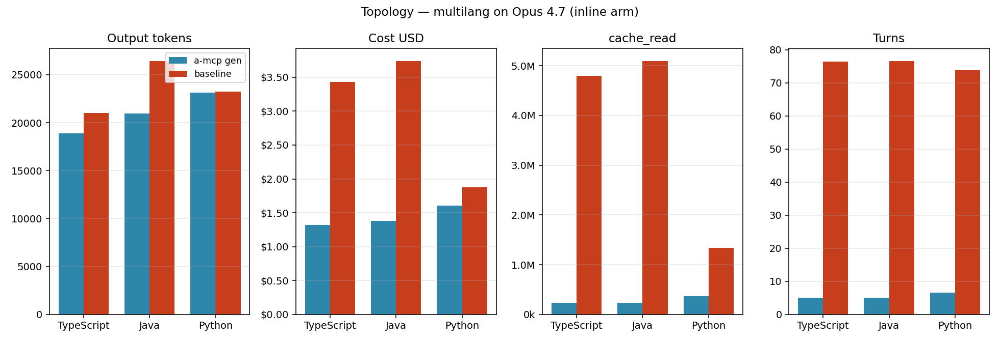
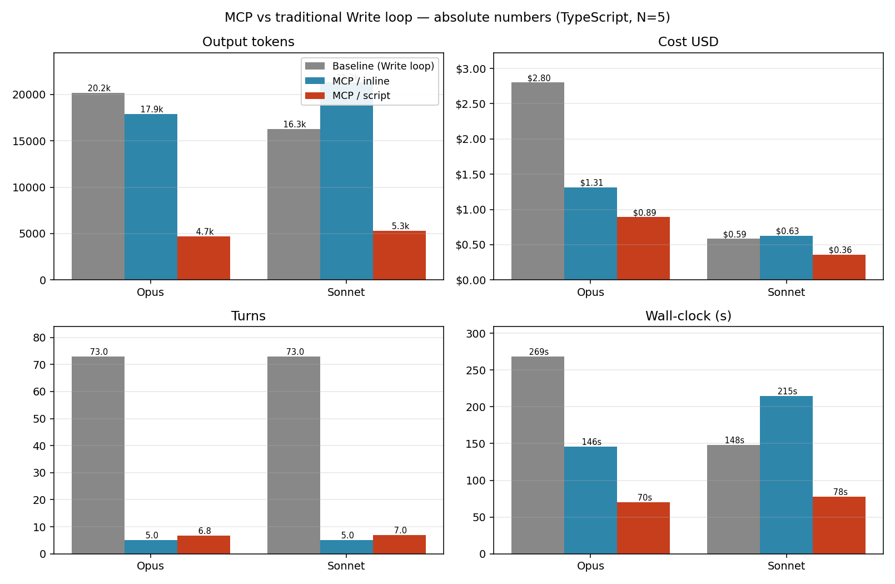
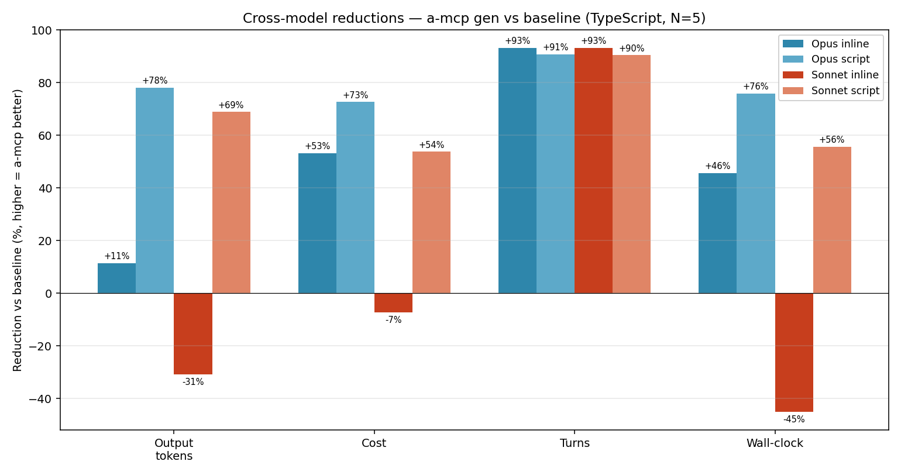
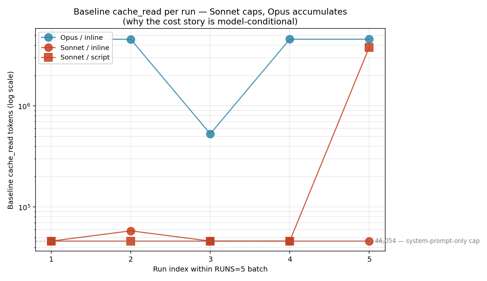
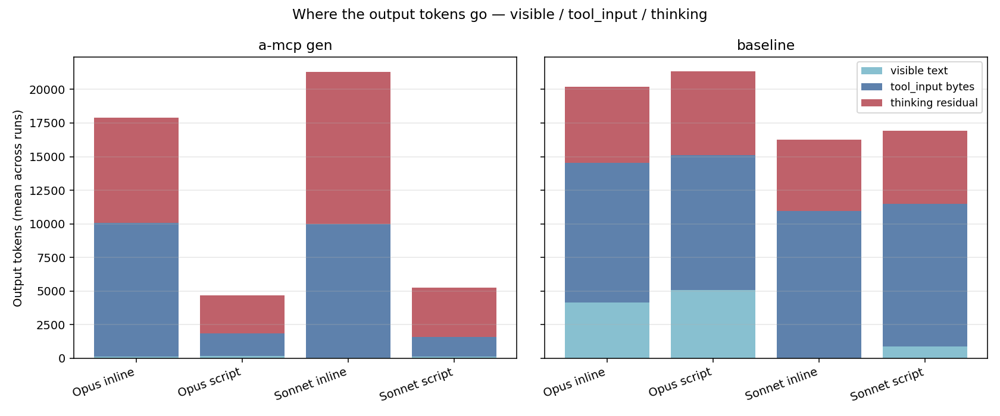
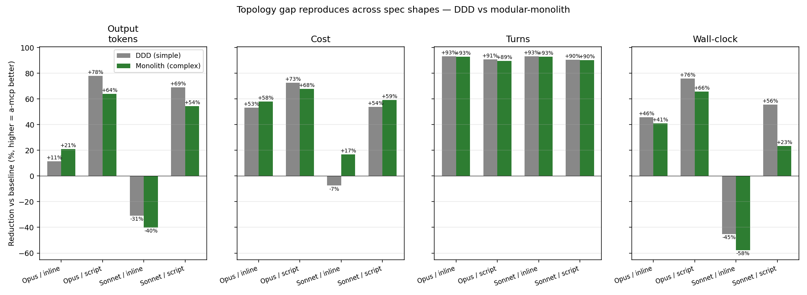

# What I observed running this harness

I'm not coming at this as a researcher — I'm a practitioner who built MetaEngine and got curious. While testing the MCP server I noticed two patterns I find genuinely interesting: agents using the MCP show meaningfully shorter loops and lower derived cost than agents writing the same code by hand, on moderately-sized codebases of either uniform-DDD or modular-monolith shape. This document is what I observed, the mechanisms I think explain it, and the limits of what I measured. I'm sharing it because the mechanisms feel structural enough that other people poking at them seems worthwhile — and because the harness itself was a fun thing to build.

**Numbers are illustrations from one author, one machine, N=5 per (language, model, shape, arm) cell.** The harness covers TypeScript / Java / Python, Opus 4.7 + Sonnet 4.6, DDD + modular-monolith spec shapes, and three invocation arms (inline / script / heredoc) — though not every combination is filled in. The Cross-model section below tests how much of the topology + invocation patterns are Opus-specific vs model-agnostic; the Cross-shape section tests them against a more complex spec. The harness is open, the prompts are in the repo, the result-event totals come straight from `claude -p` — but they're observations from a tiny per-cell sample. Reproducing on your own setup is the only thing that tells you whether the patterns hold for you.

**Charts** for the headline tables are in [`figures/`](figures/) — regenerate with `./tools/setup-charts.sh && ./.venv/bin/python ./tools/plot.py` after promoting any new experiment to `results/`.

---

## What the harness measures

Two Claude agents produce the same DDD codebase from the same spec:

- **a-mcp** — uses the MetaEngine MCP, which generates all files in one call.
- **b-baseline** — uses Claude's built-in `Write` tool, one file at a time, no MCP access.

For a-mcp I run two sessions per iteration: a *warmup* (agent reads `linkedResources` and writes a knowledge brief) and a *gen* (agent uses the brief, calls the MCP). Each session gets its own `claude -p` invocation and its own `result` event. That gives me an exact split between the one-time cost of teaching the model how MetaEngine works and the per-codebase cost of using it. **Steady-state is `gen` alone** — the warmup is the outside-training tax, what a non-trained model pays once.

For both arms I check that the output compiles cleanly (`tsc --strict` / `javac` / `python -m py_compile`) and that every spec entity has a structurally-correct file (aggregates as classes-with-constructor, services as classes-with-method-stubs, enums with each member in its expected form). That second check is what catches "fast but wrong" — the engine emitting interfaces instead of classes, or method names changing in unexpected ways. The judge tolerates idiomatic transformations (Java `ALL_CAPS` enum members, Python `snake_case` methods) — those are features of the engine, not failures.

Authoritative numbers come from `claude -p`'s `result` event. A note for anyone parsing stream-json: per-event `usage.output_tokens` is *visible-text only* — it excludes thinking tokens and tool_use input bytes. I built a parser early on that summed those events and under-reported by 88×. The result event's aggregate is the ground truth.

### A note on dollar figures in this document

Token counts (input, output, cache_read) are the structural measurements; dollar amounts are a derived quantity from token totals × Anthropic's published pricing **as of 2026-04-26**. They appear here in two places where the *billing channel* is itself the story (Observation 2: tool_use input bytes are billed as output tokens; Cross-model: how Sonnet's lack of cache accumulation propagates into cost). The Observation 1 topology table reports tokens, turns, and cache_read directly — those are what the underlying mechanism produces. Treat dollar amounts as illustrations under one pricing snapshot, not invariants.

---

## Observation 1 — Topology: agents using a batched MCP run shorter loops

### What I saw, three languages

Steady-state (a-mcp gen vs baseline; warmup excluded). N=5 per language.

| Metric | TypeScript | Java | Python |
|---|---|---|---|
| Output tokens (a-mcp / baseline) | 18,872 / 21,007 | 20,955 / 26,435 | 23,131 / 23,236 |
| Turns (a-mcp / baseline) | 5.0 / 76.4 | 5.0 / 76.6 | 6.6 / 73.8 |
| cache_read (a-mcp / baseline) | 232k / 4.80M | 234k / 5.10M | 365k / 1.33M |
| Pass rate | 4/5 / 5/5 | 5/5 / 5/5 | 5/5 / 5/5 |

Turn count, cache_read, and output tokens are the structural measurements. Cost is a derived quantity (tokens × current Anthropic pricing) and is reported in the cross-model and invocation tables below where the *billing* mechanism itself is the story. For Observation 1 the structural pattern is what to read off: the turn-count ratio is **11–15× across all three languages**; cache_read drops 73–95%; **output tokens move only 0–21%** — small, noisy, language-dependent. I wouldn't lead with output reduction; what feels actually interesting is the agent-loop numbers, because they look structural rather than incidental.

Source folders: [`results/ts-multilang/`](results/ts-multilang/summary.md), [`results/java-multilang/`](results/java-multilang/summary.md), [`results/python-multilang/`](results/python-multilang/summary.md). Chart: [`figures/multilang-topology.png`](figures/multilang-topology.png).



### The mechanism, as best I can describe it

When the agent writes 71 files via `Write`, each call's input + result lands in the conversation context. Every subsequent turn re-reads that growing context — `cache_read` accumulates cumulatively across the loop. At 73 turns, baseline reaches ~4.8M cache_read tokens. The MCP arm makes one batched tool call: spec in, all files out, context grows by O(1). At 5 turns, ~232k cache_read. The exact form of accumulation (linear / quadratic / something else) would require per-turn instrumentation I haven't done — I'm inferring from totals.

Per-turn cache_read is similar in both arms (~40–60k). The headline gap comes from the **turn count**, not from per-turn behavior. So the load-bearing variable is "did the agent emit many small calls or one big one?" — which I think generalizes beyond MetaEngine: any MCP that consolidates many outputs into one tool result should show similar agent-loop properties.

### What scales with the language

- **Output-token gap scales with per-file ceremony.** Java's per-file boilerplate (package decl, full imports, getters/record) gives baseline more bytes to write per turn than the MCP's batched call adds. Python's lighter syntax means baseline and a-mcp end up roughly tied on output. Predicted; held.
- **cache_read reduction also scales with per-file size.** Python baseline's per-turn cache_read is ~18k vs Java's ~66k — the multiplier is the same (more turns) but the absolute magnitude differs, so the percentage reduction looks smaller for Python (73%) than Java/TS (95%). Cost follows cache_read.
- **Pass rate held at 5/5 for both arms in Java.** Going in, what I actually doubted wasn't Claude's per-file capability — that I trust — it was whether baseline could complete the work within the 100-turn cap I'd set. At 76.6 turns Java baseline used ~77% of budget. Comfortably under, but visibly closer than I'd assumed. The "would baseline run out of budget" worry didn't materialize on Opus 4.7 / 1M context; on a smaller-context model with fewer turns available, the cap could become the binding constraint before fidelity is.

### Predictions vs results — honest scorecard

I made predictions in the framing notes before running the multi-language sweep:

| Prior | Result |
|---|---|
| Java widens output-token gap to 25–40% | 20.7% (vs TS 10.2%) — partial |
| Java baseline gets uncomfortably close to the 100-turn cap | 76.6 turns, ~77% of cap — close-but-fits |
| Python ≈ break-even on output tokens | 0.5% reduction — confirmed |
| Python still shows large cost reduction | Only 14.4% — wrong |
| cache_read reduction is structural and stable | Magnitude is not; turn-count reduction is — partial |

So 1 confirmed, 2 partial, 1 close-but-fits, 1 wrong. The dollar-saving magnitudes turned out to be more workload-specific than I'd given them credit for. The turn-count reduction is the one prior I'd still trust; the rest taught me to be more careful. Worth flagging explicitly: I never quite predicted baseline would *fail* — Claude's per-file capability has never been my doubt. What I doubted was whether baseline could finish within the configured turn budget. It did on every language at N=5, with the closest call (~77% of cap) on Java.

### Caveats specific to this observation

- **One shape per Observation 1 cell (71-entity DDD).** A modular-monolith reproduction lives in the Cross-shape section below; spec scaling (200 / 500 / 1000 entities) is unmeasured. The mechanism (cumulative re-read scales with N²) suggests the gap widens with size; I haven't confirmed.
- **One model per Observation 1 cell (Opus 4.7, 1M context).** A Sonnet 4.6 reproduction lives in the Cross-model section below. Haiku and smaller-context models remain untested — the 76-turn baseline might not fit in a 200k-context window.
- **Wide variance on Python.** Baseline runs varied roughly 2.5× across 5 iterations on the cost-derived metric (the underlying token totals were stable; cache_read accumulation drove the spread). N=10 or N=20 would tighten this.
- **One run in TS a-mcp produced bad code** — the agent invented `Date1`/`Date2` types for two ctor params of the same primitive type instead of using `primitiveType: "Date"` for both. 1/5 failure. Baseline didn't fail at N=5 — but at smaller models or larger specs that could flip.

---

## Observation 2 — Invocation: a transformer script shows lower output than inlined args

This is a separate effect from the topology one — they stack but they're different mechanisms.

### What I saw on TypeScript (three arms, RUNS=5 PARALLEL=5)

All three arms use the same warmup brief and the same MCP. They differ only in *how the spec reaches the engine*.

| Arm | What the agent does | Output (mean) | Cost | Pass | Wall-clock per gen |
|---|---|---|---|---|---|
| **inline** | spec embedded in `generate_code` tool args | 17,913 | $1.31 | 5/5 | 146s |
| **heredoc** | spec dumped to file via Bash heredoc, then `load_spec_from_file` | 20,217 | $1.44 | 4/5 | 175s |
| **script** | small Python transformer writes the file at runtime, then `load_spec_from_file` | **4,691** | **$0.89** | 4/5 | **70s** |

Script arm: −74% output tokens vs inline, −32% cost, ~2× faster end-to-end. Heredoc: slightly worse than inline (+13% output, +10% cost). The 5× gap between heredoc and script was the surprise — I had assumed the file-path mechanism was doing most of the work, and the data said the opposite. The two-axis design lets me isolate which property drives the win:

- **Inline vs heredoc** — same channel (model emits bytes), different tool. Tests if file-path alone helps. **It doesn't.**
- **Heredoc vs script** — same tool, different authoring. Tests if transformation logic helps. **It does — by ~5×.**

Source folders: [`results/ts-invocation-inline/`](results/ts-invocation-inline/summary.md), [`results/ts-invocation-heredoc/`](results/ts-invocation-heredoc/summary.md), [`results/ts-invocation-script/`](results/ts-invocation-script/summary.md).

### The mechanism

Tool_use input bytes — the structured JSON the model emits as tool arguments — are billed as output tokens by the API. The same is true for Bash heredoc content — the model emits the literal characters, even though they end up as a file on disk. **Only data routed through `Write` (or any tool whose argument is a *file path* and which reads content from disk itself) escapes that billing channel.**

The script arm shows lower output because the *transformation logic* is much shorter than the *data*. ~80 lines of Python that loops the source spec and emits the MetaEngine spec format → ~5k output tokens. The 9.6k tokens of structured JSON the inline arm emits as `generate_code` arguments → gone, replaced by ~2k tokens that say "run this script and load the file."

**Important caveat:** *this win exists because of how Anthropic currently bills tool_use input bytes*. If that changes — say, structured tool args above some size get a separate billing tier — the script arm's headline shrinks. The pattern is real today, but it's an architectural consequence of the current billing model, not a fundamental law.

### Cross-language reproduction

Same idea, run on Java and Python:

| Language | Inline → Script (output) | Inline → Script (cost) | Script pass rate |
|---|---|---|---|
| TypeScript | −73.8% | −32.0% | 4/5 |
| Java | −70.6% | −33.6% | 5/5 |
| Python | −76.4% | −42.9% | 5/5 |

14 of 15 script-arm runs across three languages compiled clean and passed structural verification. Script-arm absolute output sits in a **4.7k–5.8k token band** across all three languages — a 23% spread. Compare to the inline arm's 17.9k–23.1k (a 1.3× spread). The script approach normalizes output volume across languages — agents respect the *idiom of the target language* (TS one-line method bodies; Python multi-line `def name(self): \n    raise NotImplementedError`) but the structural amount of work is the same.

Source folders: [`results/java-invocation-inline/`](results/java-invocation-inline/summary.md), [`results/java-invocation-script/`](results/java-invocation-script/summary.md), [`results/python-invocation-script/`](results/python-invocation-script/summary.md). Python's inline baseline is `python-multilang/`.

### What 5 independent agents wrote (the convergence story)

This was the part I had the most fun looking at. I read through all 5 TypeScript script-arm runs side by side. The agents had identical prompts (same warmup brief, same schema-translation table, same allowed tools); they differed only in stochastic generation. They converged on a 7-step skeleton:

1. Path constants (SRC, DST)
2. Primitive-type map dict
3. `kebab()` helper
4. Field-translation helper
5. Load source spec
6. Loop domains → branch on kind → emit aggregates / value_objects / enums; loop services → emit with customCode + templateRefs
7. Write JSON to disk

Line counts: 97, 109, 111, 115, 126. Cosmetic variation (variable names, regex strategies, helper organization) is high; the structural shape is identical. **3 of the 5 runs produced byte-identical MetaEngine spec JSON** (md5 `4436d50…`).

The 1/5 failure (run-002, 16 tsc errors) is structurally diagnosable: it's the only run with split, inconsistent field-translation helpers — and the inconsistency is the bug. The other 4 runs all use a unified field-translation function. That's a useful pattern observation: when the agent's script duplicates logic with subtle inconsistencies, that's where bugs hide.

I want to be honest about what this convergence does and doesn't show. The agents shared a prompt with a verbatim translation table and an example. Convergence on the structural skeleton given that level of guidance is expected — it's not "5 independent agents arrived at the same solution from scratch." The genuinely interesting part is (a) the cosmetic variance is wide while the structural shape is narrow, and (b) the failure mode is structurally identifiable instead of random.

### Latent bugs all 5 scripts share

These don't trip on the benchmark spec but would on a richer one:

1. **"First aggregate per domain" assumption.** All 5 scripts pick the first aggregate they find in a domain and only handle `$Agg`-substitution for that one. A service method whose parameters reference an aggregate from a *different* domain would emit the literal type name without a `templateRefs` entry, and the engine would treat it as unknown.
2. **Run-005's "all fields are primitive" assumption.** Its `translate_field` helper does `PRIM_MAP[field["type"]]` with no fallback — would `KeyError` on any non-primitive field.

Both stay latent because the benchmark spec doesn't exercise them. They tell me the script approach is brittle to spec extensions in ways the inline approach isn't (with inline, the agent processes each entry consciously). **For richer specs, the script approach probably needs a more careful prompt** — or the agent has to self-iterate after seeing failures.

### Caveats specific to this observation

- **The script-arm advantage only holds when the spec is computable from a smaller source you already have.** If you're authoring the MetaEngine spec by hand from scratch, there's no smaller source — a "transformer" would just hardcode it, which is no shorter than inline. The benchmark spec is generated procedurally from `generate-spec.py`; that's exactly the script-arm's sweet spot. The crossover point — at what spec size or how-much-derivability the advantage disappears — is something I haven't measured.
- **The win depends on the current billing model** for tool_use input bytes. (Mentioned above; worth saying twice.)
- **Pass rate is 4/5 for TS script arm** vs inline's 5/5. The single failure was `Date1`/`Date2`-style LLM variance, not arm-specific. But N=5 isn't enough to say whether the script arm is genuinely less reliable than inline, or just sampling noise.
- **Heredoc is retired** as a future-comparison arm. Its job was answering "does file-path alone help?" — once the data said no, it has no further use. Kept callable in the harness for reproducibility of these numbers, not recommended for new comparisons.

---

## Cross-model — does this reproduce on Sonnet 4.6?

After landing the Opus 4.7 canonical, I ran a TypeScript reproduction on Sonnet 4.6 (PARALLEL=1, RUNS=5 per arm) to test whether the patterns are model-agnostic or Opus-specific. Source: [`results/ts-inline-sonnet/`](results/ts-inline-sonnet/summary.md), [`results/ts-script-sonnet/`](results/ts-script-sonnet/summary.md).

### Absolute numbers — MCP vs traditional Write loop

The same numbers in absolute terms first, before the reduction-percentage view. Gray bars are the traditional Write-loop baseline (no MCP); blue and red are the two MCP arms.



What stands out at a glance:

- **Turns** collapse universally: baseline ~73, MCP inline 5, MCP script ~7. Same on both models.
- **Output, cost, and wall-clock** are dramatic on Opus (script gen costs $0.89 vs baseline's $2.80; takes 70s vs 269s) and on Sonnet for the script arm ($0.36 vs $0.59; 78s vs 148s).
- **Sonnet inline regresses** — the blue bar in three of four panels exceeds the gray bar (output 21.3k vs 16.3k baseline; wall-clock 215s vs 148s; cost barely below at $0.63 vs $0.59). On Sonnet, choosing inline over baseline is a *loss* on most metrics.

### Reductions across all four conditions

The percentage view of the same data — useful for "how much" comparisons:



Arrow shows the direction of a-mcp gen relative to baseline: ↓ = a-mcp is lower, ↑ = a-mcp is higher. For every metric here (turns, output, cost, wall-clock) lower is better, so ↓ entries are favorable for a-mcp and ↑ entries are unfavorable.

| a-mcp gen vs baseline | Opus inline | Opus script | Sonnet inline | Sonnet script |
|---|---|---|---|---|
| Turns | ↓93% | ↓91% | **↓93%** | ↓90% |
| Output tokens | ↓11% | ↓78% | **↑31%** | ↓69% |
| Cost | ↓53% | ↓73% | **↑7%** | ↓54% |
| Wall-clock | ↓46% | ↓76% | **↑45%** | ↓56% |
| Pass rate (a-mcp / baseline) | 5/5 / 5/5 | 5/5 / 5/5 | 3/5 / 5/5 | 5/5 / 5/5 |

Three observations:

1. **The turn-count reduction reproduces exactly.** Opus +93%, Sonnet +93%. That's the structural property surviving cleanly — it's a function of tool topology and prompt, not the model. Of every claim in this document, this is the one I'd put weight on.
2. **The inline-arm cost story does NOT reproduce on Sonnet.** Output, cost, and wall-clock all *invert* — a-mcp inline is *worse* than baseline on every dimension except turns. Two independent shifts drive this: Sonnet baseline emits dramatically less visible text than Opus baseline (the *Sonnet doesn't narrate* aside below explores this directly), and Sonnet a-mcp gen allocates ~44% more thinking when constructing the structured `generate_code` call (11.3k thinking tokens vs Opus's 7.8k).
3. **The script-arm cost story DOES reproduce on Sonnet** — and pass rate is higher (5/5 vs Opus's 4/5). Output −69%, cost −54%, wall-clock −56%. The script-arm mechanism (route data through disk → avoid tool_use bytes) doesn't depend on the model accumulating cache_read or allocating thinking a particular way; it survives the model swap intact.

### Aside — Sonnet doesn't narrate

The most concrete model-behavior difference I saw: in the same baseline task — write 71 files via the Write tool — Opus emits roughly 4,162 visible tokens of running narration ("I'll start by creating the aggregates folder…", "Next, the value objects…"); Sonnet emits roughly **16**. About 260× less. Sonnet runs the same Write loop in near-silence.

This isn't an artifact of the prompt — both arms get the same baseline prompt — and it isn't compensated for by extra thinking on Sonnet baseline (thinking is also lower). Sonnet just appears to produce far less inter-turn commentary in long tool loops on this task.

Two consequences fall out of this:

- It explains a substantial chunk of why the inline arm regresses on Sonnet. The "MCP saves output tokens" framing implicitly assumed the *baseline* would emit narration tokens too. When the baseline emits ~16 visible tokens, there's nothing left for the MCP to save on the visible-text axis. The `tool_use` input bytes the inline arm pays then dominate.
- It's the kind of structural per-model behavior that I hadn't seen called out anywhere — and it has practical implications for any benchmark comparing across models. If you're comparing two agents on output tokens and one is Sonnet, you may be measuring "did Sonnet narrate today" more than the thing you intended.

I'm not making strong claims about why this happens (training data, model-specific prompt-following, RLHF differences are all candidates and I can't tell from outside). What I can say is the gap is consistent across all 10 Sonnet baseline runs in this harness, so it's reproducible behavior on this task at this date, not run-to-run variance.

### The cache anomaly



Sonnet's prompt cache, at this date, **does not accumulate consistently across the 73-turn baseline loop.** In 9 of 10 Sonnet baseline runs across the inline + script experiments, baseline `cache_read` capped at exactly **46,054** — that's the system-prompt-only prefix being cached, with none of the conversation prefix accruing hits. Opus baselines accumulate 0.5M to 6M `cache_read` over the same 73-turn loop. (One outlier Sonnet baseline did reach 3.8M, but it's an exception, not the rule.)

**N=5 caveat.** 9-of-10 capping at exactly 46,054 is striking, but at N=5 per arm I cannot rule out that this represents the start of a bimodal distribution rather than a hard cap — the 3.8M outlier could be the rare upper mode rather than a one-off exception. N≥20 on Sonnet baseline runs would test this directly. I have not run that experiment; the framing here should be read as "consistent observation at small N," not "verified hard cap."

The cause is opaque from outside — it could be a Sonnet-specific cache-eviction policy on long contexts, a `claude -p` model-aware difference in how `cache_control` is sent, or something else. What matters for the comparison is that **the inline-arm cost reduction on Opus depended on baseline accumulating cache_read**, and on Sonnet that accumulation breaks. The cost reduction I measured on Opus is more contingent than I'd given it credit for.

### Where the bytes go — decomposition across model × arm



Stacked output-token decomposition makes the model differences visible:

- **Sonnet inline a-mcp gen** is dominated by thinking (~11k tokens, ±5.6k variance). The model spends most of its output budget reasoning about how to construct the structured `generate_code` call.
- **Sonnet baseline** has near-zero visible text — Sonnet writes 71 files without narrating the loop.
- **Both Opus and Sonnet script-arm a-mcp gen** are tiny — under 6k tokens, dominated by thinking, with very small tool_input (just the script's chars + the file-path arguments). The script arm normalizes output volume across models.

### What this updates in the original framing

- **Reinforces:** turn-count reduction is structural. It survived a model swap that broke most everything else. The most load-bearing claim in this document.
- **Reinforces:** the script arm is the more model-robust pattern. Its mechanism doesn't depend on cache accumulation.
- **Updates:** the inline-arm cost reduction I measured on Opus is partially model-dependent. The honest framing is "Opus accumulates cache_read on long Write-loops in a way that drives most of the cost gap; Sonnet at this date doesn't, and the inline-arm gap closes (or inverts) as a result."
- **Updates:** I had positioned the script pattern as an *optimization on top of* inline. On Sonnet, script is what *works at all*; inline regresses below baseline. The script pattern's structural status is stronger than I'd framed it before.

---

## Cross-shape — does this reproduce on a more complex spec?

The DDD spec was deliberately uniform — every domain has the same shape, no cross-domain refs, symmetric depth. That tested agent-loop efficiency in isolation, but it didn't exercise the parts of MetaEngine that handle real-codebase complexity: cross-module references, asymmetric paths, shared kernel types. So I built a second spec — a **modular-monolith** with three concrete complexity features:

- **Asymmetric depth** — `orders/` has sub-modules (`orders/cart/`, `orders/checkout/`, `orders/fulfillment/`) while `catalog/` and `customers/` are flat.
- **Shared kernel** — `Money`, `Currency`, `Id`, `Timestamp`, `Result` live in `shared/` and are referenced by every other module.
- **Cross-module orchestrators** — `CheckoutOrchestrator.placeOrder(cartId, customerId, paymentMethodId): Order` references types from `customers/`, `orders/`, `orders/cart/`, and `shared/`. `FulfillmentOrchestrator.notifyCustomer` spans three modules similarly.

68 entities total, comparable to DDD's 71. Same `kind=` vocabulary (aggregate / value_object / enum / service) — only the *organization* changes. Spec generator: [`spec/generate-spec-monolith.py`](spec/generate-spec-monolith.py). Source folders: [`results/ts-monolith-opus-inline/`](results/ts-monolith-opus-inline/summary.md), [`results/ts-monolith-opus-script/`](results/ts-monolith-opus-script/summary.md), [`results/ts-monolith-sonnet-inline/`](results/ts-monolith-sonnet-inline/summary.md), [`results/ts-monolith-sonnet-script/`](results/ts-monolith-sonnet-script/summary.md).

### What I expected — and was wrong about

Going in, my actual priors were:

1. **Baseline would burn deeper into its 100-turn cap on the more complex spec.** Cross-module imports, name collisions, asymmetric paths — these felt likely to push baseline closer to the cap, possibly close enough to bind. I never doubted Claude's per-file capability; what I doubted was the budget margin shrinking under added complexity.
2. **The script arm's documented latent bugs would surface.** First-aggregate-per-domain assumption, no cross-module ref handling. I expected script pass rate could drop from DDD's 4/5 to lower.

**Both turned out closer to neutral than I'd expected. All four arms produced 5/5 a-mcp pass and 5/5 baseline pass, on both Opus and Sonnet — 20 of 20 runs compile-clean and structurally complete.** Baseline averages on monolith stayed in the same 73–76 turn band as DDD; it didn't blow the cap, and it didn't degrade in fidelity. Script pass rate went *up* (5/5 vs DDD's 4/5) once the cross-module-aware prompt named the concerns explicitly.

The honest update: **the topology argument doesn't depend on baseline being unable to handle complex specs.** It stands on agent-loop efficiency alone. The turn-cap margin worry is real but it's binding farther out — smaller-context models, larger specs, the questions in *What I haven't measured*.

### Reductions across both shapes



| a-mcp gen vs baseline | DDD (simple) | Monolith (complex) |
|---|---|---|
| **Opus inline** | output ↓11% / cost ↓53% / turns ↓93% / wall-clock ↓46% | output ↓21% / cost ↓58% / turns ↓93% / wall-clock ↓41% |
| **Opus script** | output ↓78% / cost ↓73% / turns ↓91% / wall-clock ↓76% | output ↓64% / cost ↓68% / turns ↓89% / wall-clock ↓66% |
| **Sonnet inline** | output ↑31% / cost ↑7% / turns ↓93% / wall-clock ↑45% | output ↑40% / cost ↓17% / turns ↓93% / wall-clock ↑58% |
| **Sonnet script** | output ↓69% / cost ↓54% / turns ↓90% / wall-clock ↓56% | output ↓54% / cost ↓59% / turns ↓90% / wall-clock ↓23% |

Three observations:

1. **Turn-count reduction is identical across shapes.** ~93% on every (model, arm) pair, both shapes. That's the structural property doing its job — it's a function of tool topology, not spec content.
2. **Output and cost reductions are slightly smaller on monolith.** A-mcp output for both arms grows on the more complex spec (cross-module `templateRefs` add bytes that can't be removed), so the gap closes a bit. Script-arm output goes from 4.7k (DDD) to 8.5k (monolith) on Opus — about 2× larger — but baseline output also grows (more files with more imports), so the percentage reduction stays in the +50–70% band.
3. **Sonnet inline regresses harder on monolith** — output −40% vs DDD's −31%, wall-clock −58% vs DDD's −45%. Sonnet allocates even more thinking on the more complex structured tool args (output decomposition would show this if I extended the chart). The "inline isn't a good choice on Sonnet" observation strengthens with complexity.

### Cross-module typegraph works

Eyeballing one orchestrator from the Opus inline monolith run confirmed the engine resolved every cross-module import correctly:

```typescript
// src/orchestrators/services/checkout-orchestrator.ts
import { PaymentMethod } from '../../customers/value-objects/payment-method';
import { Order }         from '../../orders/aggregates/order';
import { Id }            from '../../shared/value-objects/id';
import { Result }        from '../../shared/value-objects/result';
import { Cart }          from '../../orders/cart/aggregates/cart';     // ← cross-submodule
import { Money }         from '../../shared/value-objects/money';

export class CheckoutOrchestrator {
  placeOrder(cartId: Id, customerId: Id, paymentMethodId: PaymentMethod): Order { … }
  validateCart(cart: Cart): Result { … }
  computeTotal(cart: Cart): Money { … }
}
```

Six imports, three modules + one sub-module, all relative paths resolved correctly by the engine via `templateRefs` + `typeIdentifier`. Both inline and script arms produced equivalent imports on every monolith run.

### A separate finding — script-arm prompts can avoid documented latent bugs

DDD script-arm pass rate was 4/5 (one run-002 failure with split inconsistent helpers). Monolith script-arm pass rate is 5/5 — *better* than DDD despite the more complex spec. The difference: the monolith script-arm prompt was explicit about (a) using a unified field-translation helper and (b) handling the `module` annotation on cross-module refs. The DDD prompt left these implicit; the monolith prompt called them out by name.

The monolith script the agent wrote was notably careful — unified `field_to_property` helper, explicit `transform_type_expr` handling `Partial<T>` / `T[]` / `T | null`, and a longest-placeholder-first sort to avoid substring shadowing. None of those are in the prompt; the agent surfaced them on its own once the cross-module concern was named.

**Implication for the script-arm pattern:** the documented latent bugs aren't inherent to the pattern; they're a consequence of *under-specified prompts*. When the prompt names the concerns the agent should handle, the script comes back more careful. That's a useful refinement to the FINDINGS-INVOCATION framing — script-arm robustness is a function of how well the prompt describes the cross-module / cross-domain handling, not just whether the agent stumbles into it.

### What this updates in the original framing

- **Confirms what the experiment was always about: measuring efficiency, not capability.** Baseline handles complex specs at ~73–76 turns and ~3× the cost; what the topology pattern does is collapse the same work into 5 turns. The case for the pattern isn't "baseline can't do the work" — it's "the agent loop is dramatically more efficient regardless of complexity, and the cap-margin concern that looked plausible going in didn't materialize at this spec size on a 1M-context model."
- **Strengthens "the script arm is the more robust pattern."** It survives a model swap (Sonnet) AND a shape swap (monolith), with explicit prompt guidance keeping the latent bugs at bay.
- **Confirms the cross-model regression on Sonnet inline.** Bigger thinking allocation, bigger gap, more shape complexity makes it worse. The "inline doesn't generalize across models" finding is bolstered.

---

## The two-layer model — mechanism vs agent behavior

The single most useful framing I came out of these experiments with — and the one I'd most like other people to take away independent of MetaEngine — is that **the metrics in this kind of comparison decompose into two layers, and they behave differently.**

- **Layer 1 — Mechanism (universal).** Turn count is determined by tool topology + prompt. Tool_use input bytes are billed as output tokens regardless of model. Cache_read accumulation on a Write loop is a function of "did the agent call Write 73 times" — that's a property of the loop, not the language model. These properties survive a model swap untouched and don't depend on training data.
- **Layer 2 — Agent behavior (model-dependent).** How much a model narrates vs stays silent, how much thinking it allocates per turn, how its prompt cache responds under long-loop conditions, how it constructs structured tool args — these vary by model and may vary day-to-day at the same model version.

This decomposition is what cleans up otherwise-confusing observations in this work:

| Finding | Layer | Why it survives or breaks |
|---|---|---|
| Turn-count reduction reproduces across model + shape | Mechanism | Loop length is determined by topology, not the model |
| Script-arm output reduction reproduces across model + shape | Mechanism | tool_use bytes are billed as output for every model |
| Inline-arm cost reduction is Opus-specific | Behavior | Depended on Opus accumulating cache_read; Sonnet at this date doesn't (Cache anomaly section) |
| Inline-arm output regresses on Sonnet | Behavior | Sonnet doesn't narrate (Aside section) and allocates more thinking — neither is structural |

**Two empirical axes — model swap (Opus → Sonnet) and shape swap (DDD → modular-monolith) — both reinforce the same partition.** The mechanism-layer findings stayed intact across both axes; the behavior-layer findings shifted under both.

I think this distinction generalizes beyond MetaEngine. **Anyone benchmarking agent behavior in long tool-loops should expect their headline metrics to mix the two layers, and to be surprised when the mix shifts under a model swap or a workload swap.** The robust thing to claim is the mechanism-layer property; the behavior-layer numbers are illustrations from a particular model on a particular day.

**The practical implication for tool authors:** if you want a tool whose efficiency story is robust across models, optimize the mechanism — fewer turns, fewer bytes through the tool_use channel — rather than relying on a particular model's behavior (e.g., its cache accumulation pattern) to deliver the win. The script-arm pattern in this work is mostly mechanism-layer. The inline-arm cost reduction on Opus turned out to be partly behavior-layer, which is why it didn't survive the Sonnet swap.

This is the framing I'd most like a careful reader to take away. The specific numbers are illustrations; the layer separation is the thing.

---

## What's strong, what's weak, what's not measured

### What I'd put weight on

- **The turn-count reduction (11–15×)** reproduces consistently across all three languages and all arms. The mechanism (cumulative context re-read per turn) is straightforward. I'd predict it generalizes to other batched MCPs.
- **The script-arm output reduction (−70 to −77%)** is clean across three languages and three of five TS runs produced byte-identical specs. The pattern is real, *given current billing*.
- **The harness itself.** Parser uses authoritative result-event totals. Judge does structural verification, not just compile-clean. Prompts are language-aware. Results are gitignored timestamped folders. It's reproducible.

### What I'd put less weight on

- Any specific cost-reduction percentage. They depend on language verbosity, parallel batch effects on baseline cache, and Anthropic-side cache state day-to-day.
- The output-token reduction in the topology comparison (0–21%). Small enough that variance can flip the sign.
- Wall-clock numbers. Depend on Anthropic load on the day.

### What I haven't measured

- **Spec scaling.** Does the gap widen at 200/500/1000 entities? Mechanism suggests yes; not measured.
- **Sonnet 4.6 TypeScript** — measured for both DDD and modular-monolith (see Cross-model and Cross-shape sections). Other Sonnet languages (Java/Python) and Haiku still open.
- **Other arbitrary spec shapes.** Modular-monolith was added (2026-04-26) — see Cross-shape section. Hexagonal, workflow/state-machine, feature-sliced — MetaEngine handles them, this benchmark hasn't exercised them yet. Standardized formats with mature codegens (OpenAPI/Protobuf/GraphQL) are deliberately out of scope — those have purpose-built tooling and aren't MetaEngine's home turf.
- **Where the script arm crosses over** (small spec / non-derivable spec). Would matter for honest documentation.
- **N≥10.** N=5 is enough to see structural patterns; not enough to put confidence intervals on cost reductions.
- **What happens after agents are nudged toward the script pattern in MCP `linkedResources`.** Predicted: a meaningful fraction of "inline" runs would naturally pick the script-converted pattern once the recommendation lives in the docs. Not run.

---

## What I'm not claiming

- That MetaEngine is X% cheaper or faster. The numbers are what one author saw, not a benchmark of MetaEngine.
- That MCPs like MetaEngine are objectively the right way to do codegen. This is one design pattern; others may do better at things I haven't measured.
- That the patterns generalize beyond what's in this harness. The mechanisms (cumulative context re-read; tool_use bytes billed as output) seem structural, but I'm not the one who can prove they apply at scale.
- That Anthropic should change anything based on this. If the script-arm pattern is interesting to anyone there, the data is here for them to reproduce. If they conclude billing of tool_use input bytes ought to change — that's their call to make.

---

## How to reproduce

```bash
RUNS=5 PARALLEL=2 LANGUAGE=typescript ARM=inline ./run.sh         # canonical TS topology + inline
RUNS=5 PARALLEL=2 LANGUAGE=typescript ARM=script ./run.sh         # TS script arm
RUNS=5 PARALLEL=2 LANGUAGE=java       ARM=script ./run.sh         # cross-language reproduction
RUNS=5 PARALLEL=2 LANGUAGE=python     ARM=script ./run.sh         # cross-language reproduction
```

Each run produces `results/<timestamp>-<lang>-<arm>/summary.md`. Look at:

- The steady-state table (a-mcp gen vs baseline — output / cost / turns / cache_read / pass).
- The per-run table to spot variance.
- `run-NNN/<variant>/output/` directly — the actual generated code is the ground truth; the report can lie.

The 15 canonical result folders that produced the numbers in this document are in [`results/`](results/), one per row in the tables above. [`results/README.md`](results/README.md) maps friendly names to original timestamps.

The harness is the part of this I'm proudest of; the numbers are just what fell out when I ran it. If you find the patterns don't reproduce in your environment, or you measure something that contradicts what's here, I'd genuinely like to know — disagreement is more useful to me than confirmation.
