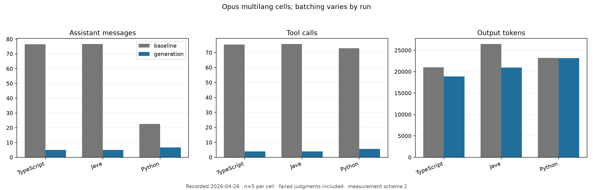
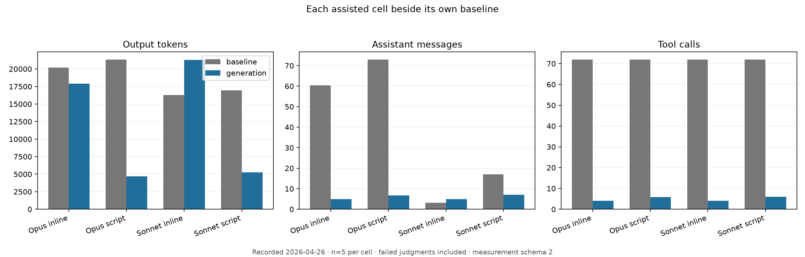
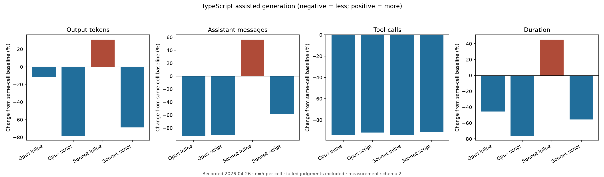
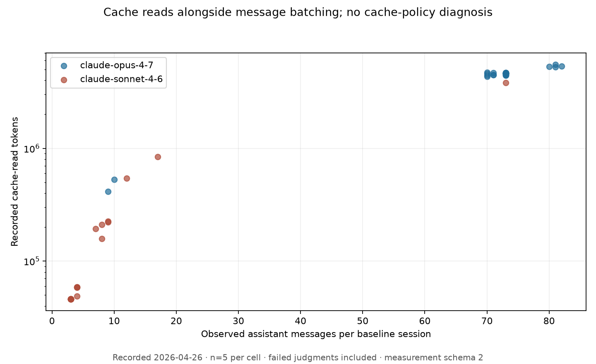
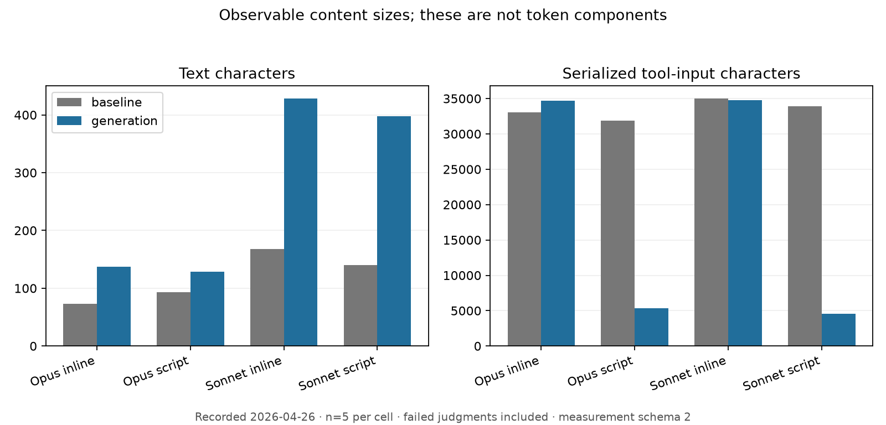
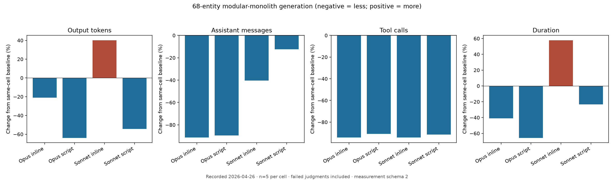

# What the recorded agent traces show

The checked-in experiments compare a prompted file-by-file `Write` workflow with MetaEngine generation, then compare inline generator input with file input produced by a transformer. There are five runs per cell across a partially filled grid of three languages, two models and two spec shapes. The observations are useful for designing another experiment; they do not establish general savings.

## Measurement correction — 2026-09-14

Reviewing the raw streams exposed two errors in the original interpretation:

1. **CLI `num_turns` was mislabeled as model turns.** In these traces it equals tool calls plus one. A single assistant message can contain many tool calls. In `ts-inline-sonnet/run-001/b-baseline`, `num_turns` is 73 but there are only three distinct assistant message IDs: read the source, request 71 Writes together, and finish. Claims that a 73-response loop reproduced across models were incorrect.
2. **Assistant-event `usage.output_tokens` was mislabeled as visible-text tokens.** Tool-only messages have nonzero values even when there is no text block. The claimed Opus/Sonnet narration gap and the inferred thinking-token residual were therefore unsupported. The corrected analysis counts actual text characters and serialized tool-input characters separately, without pretending they form a token decomposition.

The original `stream.ndjson` and `result.json` files remain unchanged. `result.json` contains legacy derived fields for historical inspection; do not use its `phases` or `measurement` fields for new analysis. [Corrected measurements](results/corrected-results.json), each cell's regenerated summary and the figures use measurement schema 2, with SHA-256 hashes tying each session to its source stream.

The original result event's total output tokens, duration, cost and cache-read fields are preserved. The correction changes message counts and interpretations, not those recorded totals. Character counts are recomputed from the sanitized streams; they need not match old estimates made before path sanitization.

```bash
python3 tools/recompute.py --check
python3 -m unittest discover -s tests -v
```

Both commands run offline. They do not invoke a model or generator.

## Setup and metric definitions

The DDD spec has 71 entities: aggregates, value objects, enums and services. The modular-monolith variant has 68, with nested modules, a shared kernel and cross-module references. Models recorded in the streams are `claude-opus-4-7` and `claude-sonnet-4-6`; collection date is 2026-04-26.

The assisted workflow first runs a warm-up session and puts its generated brief into a new generation session's prompt. Generation-only numbers describe that prepared workflow. They do not simulate a model trained on the API. Warm-up and generation totals are both present in every summary.

The baseline prompt asks for a separate `Write` operation per file. The assisted prompt asks for one generation call. A model can batch multiple Write requests into one response. The prompts differ, and each cell receives its own warm-up briefs. These are workflow comparisons with uncontrolled model and service variation.

| Metric | Source and boundary |
| --- | --- |
| Assistant messages | Distinct `message.id` values among assistant events; multiple streamed content blocks with the same ID count once. A trace-observed response count, not hidden retries. |
| Tool calls | Distinct tool-use IDs within each assistant message. |
| CLI num_turns | Original result field, retained under `claude_num_turns`; not interchangeable with assistant messages. |
| Output tokens | Original result event's `usage.output_tokens`. No prose/tool/thinking split is inferred. |
| Cache-read tokens | Original result event's `usage.cache_read_input_tokens`; an aggregate, not a cache-policy diagnosis. |
| Text characters | Length of actual text blocks, excluding thinking and tool inputs. |
| Tool-input characters | Length of `json.dumps(input, sort_keys=True)` with Python's default escaping and spacing; a consistent serialization, not exact wire bytes or tokens. |
| Session duration | Original result event's `duration_ms`; depends on load and scheduling. |
| Recorded cost USD | Original `total_cost_usd`; a dated API-equivalent figure, not subscription spending or allowance. |
| Pass | Original compiler and structural judge verdict; checks selected properties of the output, not equivalent runtime behavior. |

## Model responses and tool operations

Means [min–max] for the original multilang cells, Opus, five runs per cell, `PARALLEL=2`:

| Language | Baseline assistant messages | Assisted assistant messages | Baseline output tokens | Assisted output tokens | Assisted pass |
| --- | --- | --- | --- | --- | --- |
| TypeScript | 76.4 [73–82] | 5.0 [5–5] | 21,007 | 18,872 | 4/5 |
| Java | 76.6 [73–82] | 5.0 [5–5] | 26,435 | 20,955 | 5/5 |
| Python | 22.6 [6–74] | 6.6 [5–12] | 23,236 | 23,131 | 5/5 |

The baseline makes more tool operations by construction. It uses more model responses in these three cells, but the magnitude depends on whether the model batches writes. Python's 73.8 CLI `num_turns` is not its 22.6 assistant-message mean.



Sources: [TypeScript](results/ts-multilang/summary.md), [Java](results/java-multilang/summary.md), [Python](results/python-multilang/summary.md). All baseline passes in these cells are 5/5. For TypeScript first use, warm-up plus generation averages 31,308 output tokens versus 21,007 for baseline; the prepared-session comparison excludes that real warm-up work.

## Inline, heredoc and transformer input

TypeScript, Opus, three separate batches with `PARALLEL=5`, five runs per cell. These have different concurrency and briefs from the multilang cells.

| Assisted arm | Assistant messages | Output tokens | Tool-input characters | Duration | Pass |
| --- | --- | --- | --- | --- | --- |
| Inline | 5.0 [5–5] | 17,913 [16,154–21,021] | 34,689 | 146s [130–179] | 5/5 |
| Heredoc | 6.4 [6–7] | 20,217 [19,234–22,377] | 45,587 | 175s [150–200] | 4/5 |
| Transformer + file | 6.8 [6–10] | 4,691 [3,247–5,742] | 5,337 | 70s [54–94] | 4/5 |

The transformer arm emitted 74% fewer output tokens than inline in this sample. Writing literal JSON via Bash still routes that JSON through model output. A short program can instead read the source spec and produce the larger generator input outside that channel. The smaller observed arguments support this explanation, without isolating every cause of the total-token difference.

This needs an input spec derivable from a compact source and transformation. A hand-authored spec with little repeated structure may not benefit. The transformer also needs validation: the recorded script arm failed one judgment. These runs do not price the repair loop.

[Claude's tool-use documentation](https://platform.claude.com/docs/en/agents-and-tools/tool-use/overview) describes how tool-use content contributes to input and output usage. That billing model does not turn a character estimate into an exact token count.

Sources: [inline](results/ts-invocation-inline/summary.md), [heredoc](results/ts-invocation-heredoc/summary.md), [transformer](results/ts-invocation-script/summary.md). [Java script](results/java-invocation-script/summary.md) and [Python script](results/python-invocation-script/summary.md) retain the additional language measurements. Python's inline comparison uses the multilang batch, so concurrency differs.

## Cross-model: batching changes the conclusion

TypeScript, Sonnet, serial runs. Each batch includes its own baseline:

| Cell / arm | Assistant messages | Tool calls | Output tokens | Pass |
| --- | --- | --- | --- | --- |
| Inline batch / baseline | 3.2 [3–4] | 72 [72–72] | 16,280 [15,258–18,568] | 5/5 |
| Inline batch / assisted | 5.0 [5–5] | 4 [4–4] | 21,299 [17,474–31,142] | 3/5 |
| Script batch / baseline | 17.0 [3–73] | 72 [72–72] | 16,936 [15,803–18,298] | 5/5 |
| Script batch / assisted | 7.0 [7–7] | 6 [6–6] | 5,275 [4,075–6,530] | 5/5 |

The inline-batch baseline needs fewer assistant messages than assisted generation. Nine of the ten baseline runs across these batches use just three or four responses. One uses 73. The script-batch mean is therefore sensitive to that single run.





The earlier “cache anomaly” explanation confused tool operations with model responses. Lower cache-read totals coincide with batched Writes and fewer responses. These traces establish neither an abnormal cache policy nor a model-specific cache cap. They also do not measure exact narration-token or thinking-token allocations. For example, the Opus inline-batch baseline has a mean 72.8 actual text characters; Sonnet's has 168.2. The old 4,162-vs-16 “visible tokens” comparison was not a measurement of those text blocks.





Sources: [Sonnet inline](results/ts-inline-sonnet/summary.md), [Sonnet script](results/ts-script-sonnet/summary.md). The transformer emits fewer output tokens in both models; a universal reduction in model round trips does not follow.

## Another spec shape

The modular-monolith experiment adds one organization of 68 entities. It does not establish behavior at larger scale. Its corrected message counts retain the same distinction: baseline batching varies by run and model.



Sources: [Opus inline](results/ts-monolith-opus-inline/summary.md), [Opus script](results/ts-monolith-opus-script/summary.md), [Sonnet inline](results/ts-monolith-sonnet-inline/summary.md), [Sonnet script](results/ts-monolith-sonnet-script/summary.md).

## What to carry into another experiment

Count operations and assistant responses separately. Inspect the streams behind a surprising metric. Keep failed judgments beside resource measurements. Prefer exact recorded totals over invented component splits.

Offering multiple artifacts per call can reduce required tool operations. File input can let a compact program produce a large generator spec. Whether either choice reduces model responses, output tokens, repair effort or wall time on another workload is a question for another measurement.

The observed ranges are descriptive, not confidence intervals. Five runs per cell give little precision about population performance or reliability. The experiment was not randomized across prompts, concurrency or service time. It does not show runtime equivalence, larger-spec scaling, repair-loop cost, a model trained on this API, or exact reproducibility of the historical hosted environment.
